

# Welcome to Migration Assignment

### *name* - Shah Obayed Ahmed
### *contact* - 01749501291

## Task 1

Create a new Laravel project named "MigrationAssignment" using the Laravel command-line interface.

### Answer -

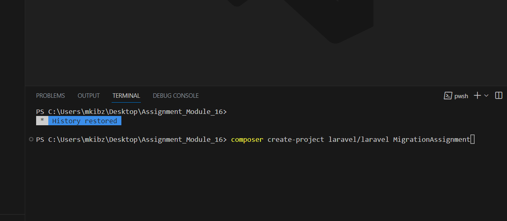

## Task 2

Within the project, create a new migration file named `create_products_table` that will be responsible for creating a table called `products` in the database. The `products` table should have the following columns:

-   `id`: an auto-incrementing integer and primary key.
-   `name`: a string column to store the product name.
-   `price`: a decimal column to store the product price.
-   `description`: a text column to store the product description.
-   `created_at`: a timestamp column to store the creation date and time.
-   `updated_at`: a timestamp column to store the last update date and time.

### Answer -

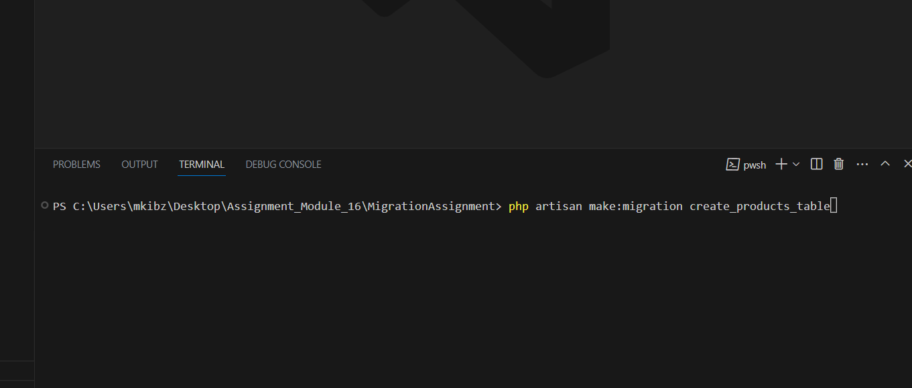

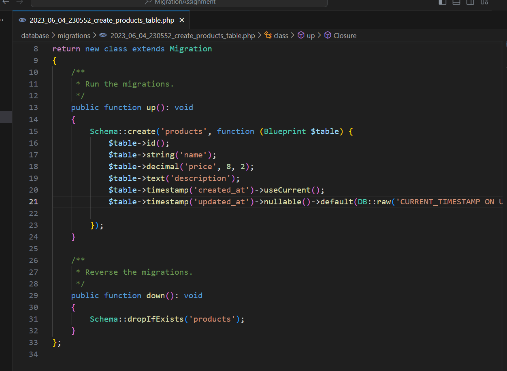

## Task 3

After creating the migration file, run the migration to create the `products` table in the database.

### Answer -

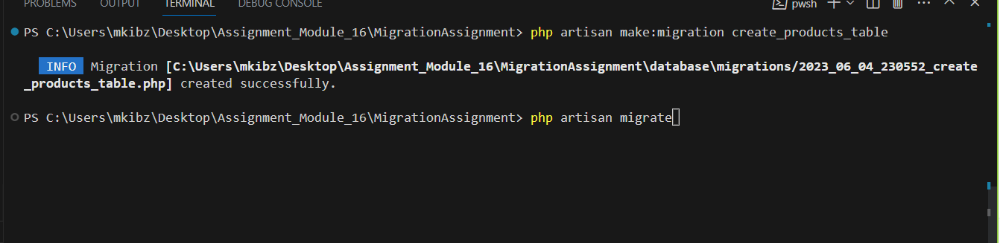

## Task 4

Modify the existing migration file "create_products_table" to add a new column called `quantity` to the `products` table. The `quantity` column should be an integer column and allow null values.

### Answer -

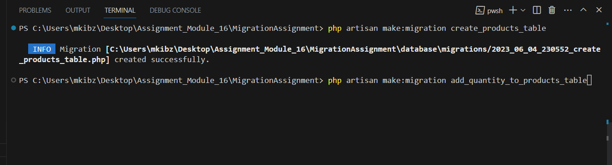

## Task 5

Create a new migration file named `add_category_to_products_table` that will be responsible for adding a new column called `category` to the `products` table. The `category` column should be a string column with a maximum length of 50 characters.

### Answer -

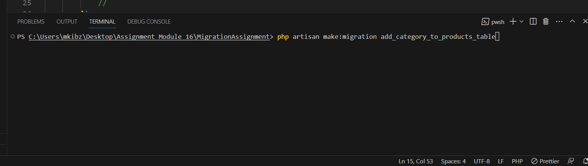
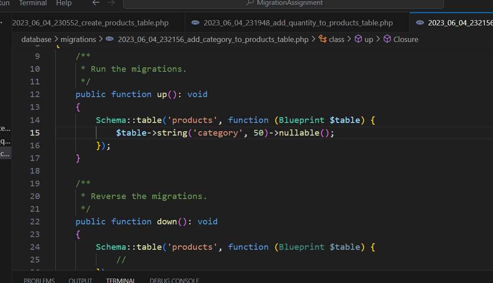

## Task 6

After creating the new migration file, run the migration to add the "category" column to the "products" table.

### Answer -

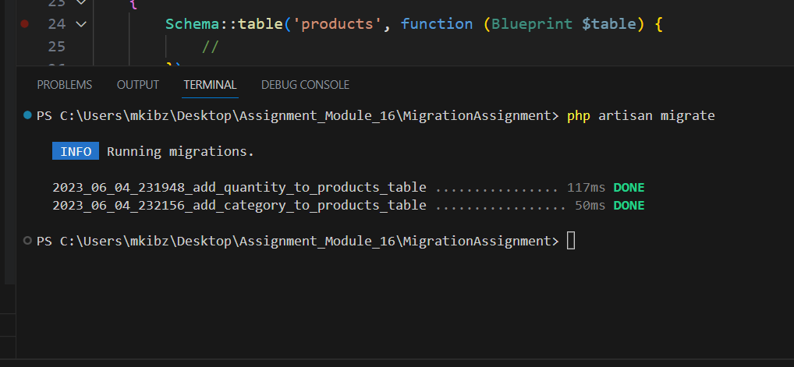

## Task 7

Create a new migration file named "create_orders_table" that will be responsible for creating a table called "orders" in the database. The "orders" table should have the following columns:

-   `id`: an auto-incrementing integer and primary key.
-   `product_id`: an unsigned integer column to establish a foreign key relationship with the "id" column of the "products" table.
-   `quantity`: an integer column to store the quantity of products ordered.
-   `created_at`: a timestamp column to store the creation date and time.
-   `updated_at`: a timestamp column to store the last update date and time.

### Answer -

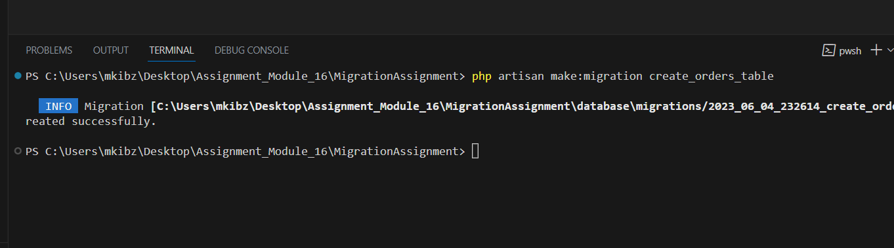
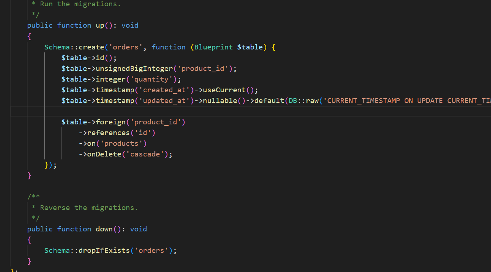

## Task 8

After creating the migration file for the "orders" table, run the migration to create the "orders" table in the database.

### Answer -

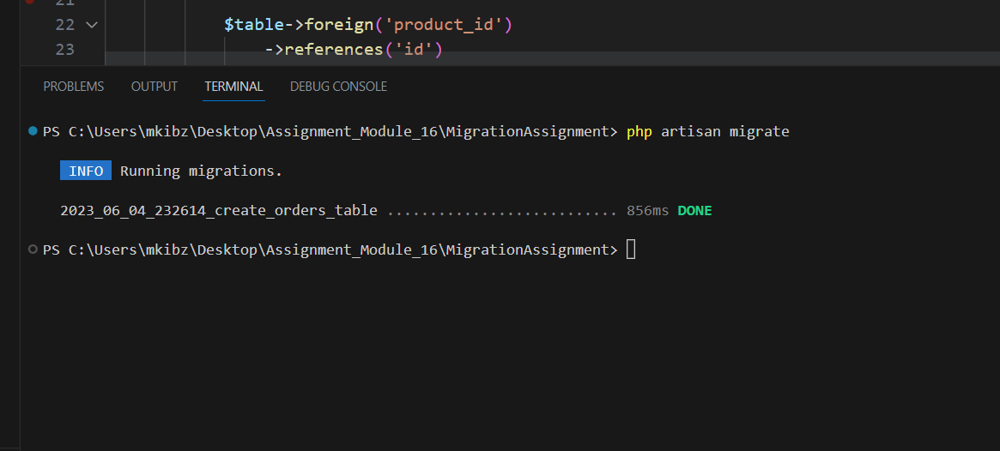

# Thank you

## Copyright
[© 2023 SHAH OBAYED AHMED. All rights reserved.](https://www.facebook.com/shah.obayed)

